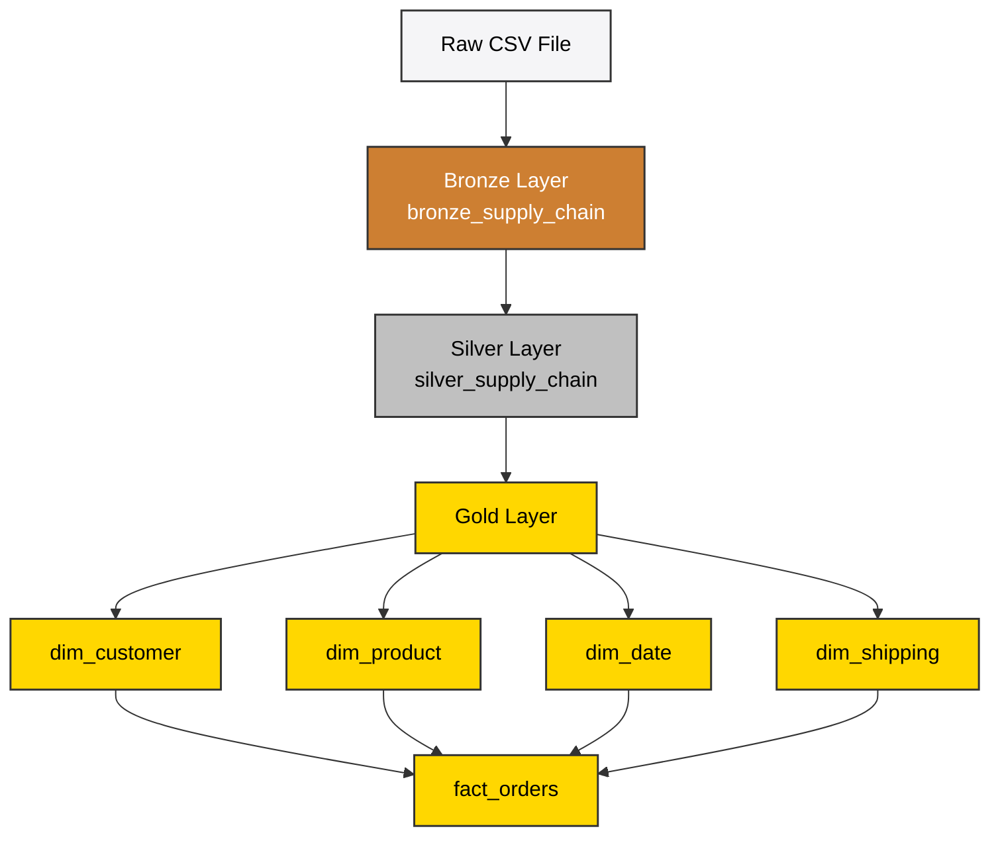
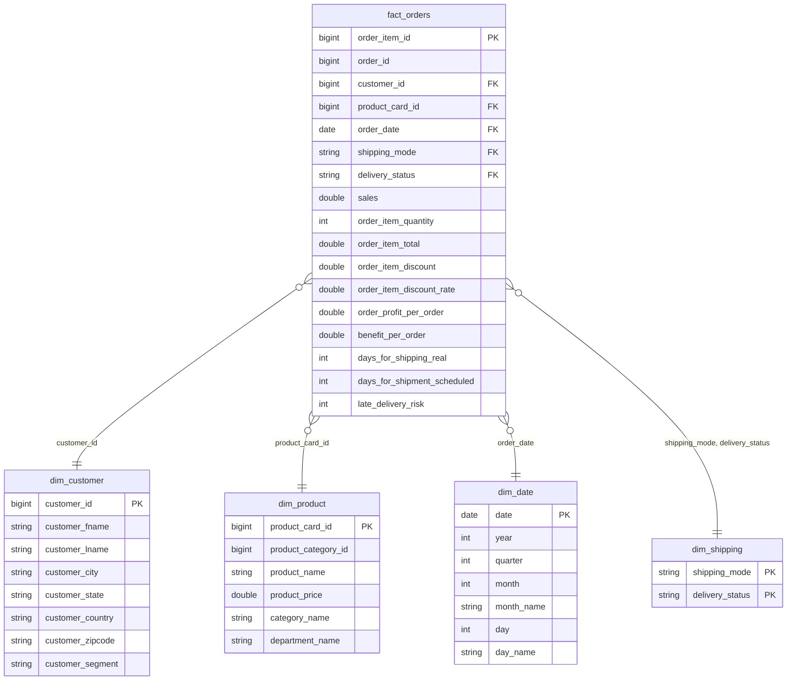

# 📊 Supply Chain Control Tower using Databricks
[](https://databricks.com/)
[](https://spark.apache.org/)
[](https://delta.io/)
[](https://www.python.org/)
[](https://en.wikipedia.org/wiki/SQL)
[](https://opensource.org/licenses/MIT)

An end-to-end modern Data Engineering pipeline demonstrating a **Supply Chain Control Tower** built on the **Databricks Lakehouse Platform**. The pipeline ingests raw supply chain transaction records, processes them through a multi-stage **Medallion Architecture** using **PySpark** and **Delta Lake**, and builds an optimized **Star Schema** managed under **Unity Catalog** for real-time visibility, operational analysis, and BI reporting.

---

## 🗺️ Project Overview

A **Supply Chain Control Tower** serves as a central dashboarding and analytics hub that provides end-to-end visibility across supply chain operations. 

This project implements the underlying data pipeline for such a control tower. It automates the ingestion of raw transactional data, runs validation audits, builds unified entities, and constructs a robust dimensional model (Star Schema). The final tables are stored in **Delta Lake** format, combining the scale of a data lake with the reliability and performance of a relational data warehouse.

```
Raw CSV (UC Volume) ──> Bronze (Raw Ingestion) ──> Silver (Enriched & Validated) ──> Gold (Star Schema BI Layer)
```

---

## 🎯 Project Objectives

- **Automated Ingestion**: Seamlessly ingest raw transactional CSV data from Databricks Unity Catalog Volumes.
- **ACID Transactions & Schema Enforcement**: Utilize Delta Lake features to ensure data integrity and track historical updates.
- **Medallion Architecture**: Implement a structured multi-layer approach (Bronze, Silver, Gold) to isolate processing concerns.
- **Enterprise Governance**: Govern all datasets (Catalogs, Schemas, Tables, Volumes) using **Unity Catalog**.
- **Analytical Optimization**: Model data into a high-performance **Star Schema** consisting of dimensions and a fact table, reducing join complexity for downstream BI dashboards.
- **Quality Assurance**: Implement automated data quality checks and validation metrics at each transformation stage.

---

## 🛠️ Tech Stack & Architecture

| Technology | Logo / Badge | Version | Role in Project |
| :--- | :---: | :---: | :--- |
| **Databricks** | `Databricks` | DBR 14.3 LTS+ | Unified processing environment and Notebook orchestration |
| **Apache Spark** | `PySpark` | 3.5.x | Parallelized distributed data processing engine |
| **Delta Lake** | `Delta Lake` | 3.1.x | Storage layer supplying ACID transactions, time travel, and schema enforcement |
| **Unity Catalog** | `Unity Catalog` | - | Centralized governance, cataloging, access control, and storage volume management |
| **Python** | `Python` | 3.10+ | Primary language for PySpark APIs and ETL logic orchestration |
| **SQL** | `SQL` | ANSI SQL | Analytical queries, dimension modeling, and BI view definition |

---

## 📊 Dataset Overview

The pipeline processes a comprehensive Supply Chain dataset containing transaction logs, logistics updates, and order details. 
- **Total Records**: `180,519`
- **Granularity**: Order item level
- **Key Attributes**: Customer details, Product catalog, Order dates, Shipment dates, Shipping modes, Delivery status, Sales, Discounts, and Profit margins.

---

## 📂 Folder Structure

The project code is organized as follows:

```directory
supply-chain-control-tower-databricks/
├── .github/
│   └── workflows/
│       └── databricks_ci_cd.yml       # CI/CD Deployment pipeline
├── notebooks/
│   ├── 01_bronze_ingestion.py         # PySpark Notebook for CSV Ingestion to Bronze Delta
│   ├── 02_silver_transformation.py    # PySpark Notebook for Data Cleaning & Silver Delta
│   └── 03_gold_modeling.py            # PySpark/SQL Notebook for Star Schema & Gold Layer
├── schemas/
│   ├── bronze_schema.py               # Predefined schema definitions for Ingestion
│   └── gold_schema.sql                # SQL DDL Scripts for dimensional tables
├── data/
│   └── supply_chain_sample.csv        # Small sample dataset for local testing
├── README.md                          # Project documentation
└── LICENSE                            # License details
```

---

## 🏆 Medallion Architecture Explanation

To deliver high-quality, reliable data for business operations, we implement the **Medallion Architecture**:

```
 ┌──────────────────────┐      ┌──────────────────────┐      ┌──────────────────────┐
 │     BRONZE LAYER     │ ───> │     SILVER LAYER     │ ───> │      GOLD LAYER      │
 │  - Raw Ingestion     │      │  - Cleaning          │      │  - Business Logic    │
 │  - Delta Table       │      │  - Schema Casts      │      │  - Dimensional Model │
 │  - Append-Only       │      │  - Data Quality      │      │  - Star Schema BI    │
 └──────────────────────┘      └──────────────────────┘      └──────────────────────┘
```

1. **Bronze Layer (Raw Ingestion)**: Acts as the landing zone. It stores raw data exactly as received from source systems without modification. This preserves history and allows reprocessing if logic changes.
2. **Silver Layer (Enriched & Validated)**: The clean-room zone. Data is cleansed, column names are standardized, dates are converted to timestamps, and data validation rules are applied.
3. **Gold Layer (Analytical Star Schema)**: The business-ready zone. Data is modeled into dimensional and fact tables designed for analytics, reporting, and machine learning.

---

## 🪵 Layer Deep Dives

### 1. Bronze Layer (Ingestion)
- **Source**: Ingests raw CSV files uploaded to `Unity Catalog Volumes`.
- **Schema**: Infers or enforces schema programmatically during ingestion.
- **Operations**:
  - Validates total record counts.
  - Detects duplicate records.
  - Explores distributions (unique customers, products, orders).
  - Standardizes column headers: Replaces spaces and special characters with underscores to make names compatible with Delta Lake (e.g., `Order Customer Id` $\rightarrow$ `order_customer_id`).
- **Storage**: Saves the dataset as a Delta table named `bronze_supply_chain`.

### 2. Silver Layer (Cleaning & Enrichment)
- **Source**: Reads from the `bronze_supply_chain` Delta table.
- **Operations**:
  - **Type Casting**: Converts text-based date fields (`order_date`, `shipping_date`) to standard PySpark `Timestamp` formats.
  - **Pruning**: Drops columns irrelevant to supply chain KPI reporting (e.g., internal metadata fields, repeated strings).
  - **Data Quality Assertions**:
    - Validates row counts match Bronze (180,519).
    - Checks that `order_item_id` contains no duplicates (uniqueness audit).
    - Flags or filters invalid/null dates.
    - Validates quantity values (ensures `quantity > 0`).
- **Storage**: Writes clean, structured records to the Delta table `silver_supply_chain`.

### 3. Gold Layer (Dimensional Modeling)
- **Source**: Reads from the `silver_supply_chain` Delta table.
- **Operations**: Separates the unified transaction log into logical Dimensions and a centralized Fact Table to establish a **Star Schema** optimized for analytical aggregates.

#### Dimensions
- **`dim_customer`**: Houses customer demographic and segment data.
- **`dim_product`**: Contains catalog information including product category, name, price, and departments.
- **`dim_date`**: Time dimension extracted from order timestamps to support time-series reporting.
- **`dim_shipping`**: Stores discrete delivery statuses and shipping methods.

#### Fact Table
- **`fact_orders`**: Captures operational transactions, linking dimensions via foreign keys and hosting numeric metrics (revenue, discount rates, margins, shipping delays).

---

## 📐 Data Modeling & Star Schema

### Dimension & Fact Table Schemas

#### 👥 dim_customer
| Column Name | Data Type | Key Type | Description |
| :--- | :--- | :---: | :--- |
| `customer_id` | `BIGINT` | PK | Unique identifier for a customer |
| `customer_fname` | `STRING` | - | Customer's first name |
| `customer_lname` | `STRING` | - | Customer's last name |
| `customer_city` | `STRING` | - | City of residence |
| `customer_state` | `STRING` | - | State of residence |
| `customer_country` | `STRING` | - | Country of residence |
| `customer_zipcode` | `STRING` | - | Postal code |
| `customer_segment` | `STRING` | - | Segment classification (Consumer, Corporate, etc.) |

#### 📦 dim_product
| Column Name | Data Type | Key Type | Description |
| :--- | :--- | :---: | :--- |
| `product_card_id` | `BIGINT` | PK | Unique identifier for a product card |
| `product_category_id`| `BIGINT` | - | Unique category identifier |
| `product_name` | `STRING` | - | Name of the product |
| `product_price` | `DOUBLE` | - | Unit price of the product |
| `category_name` | `STRING` | - | Category description |
| `department_name` | `STRING` | - | Department associated with the product |

#### 📅 dim_date
| Column Name | Data Type | Key Type | Description |
| :--- | :--- | :---: | :--- |
| `date` | `DATE` | PK | The calendar date |
| `year` | `INT` | - | Calendar year (e.g., 2026) |
| `quarter` | `INT` | - | Quarter of year (1-4) |
| `month` | `INT` | - | Numeric month (1-12) |
| `month_name` | `STRING` | - | Textual month (e.g., August) |
| `day` | `INT` | - | Day of the month |
| `day_name` | `STRING` | - | Day of the week (e.g., Saturday) |

#### 🚚 dim_shipping
| Column Name | Data Type | Key Type | Description |
| :--- | :--- | :---: | :--- |
| `shipping_mode` | `STRING` | PK | Mode of transport (Standard, First Class, etc.) |
| `delivery_status` | `STRING` | PK | Delivery status (Late, On Time, Shipping Cancelled) |

#### 🛒 fact_orders
| Column Name | Data Type | Key Type | Description |
| :--- | :--- | :---: | :--- |
| `order_item_id` | `BIGINT` | PK / Transaction Key | Transactional order item identifier |
| `order_id` | `BIGINT` | Transaction Key | Unified order identifier |
| `customer_id` | `BIGINT` | FK | Links to `dim_customer` |
| `product_card_id` | `BIGINT` | FK | Links to `dim_product` |
| `order_date` | `DATE` | FK | Links to `dim_date` |
| `shipping_mode` | `STRING` | FK | Links to `dim_shipping` |
| `delivery_status` | `STRING` | FK | Links to `dim_shipping` |
| `sales` | `DOUBLE` | Measure | Total sales revenue |
| `order_item_quantity`| `INT` | Measure | Number of items purchased |
| `order_item_total` | `DOUBLE` | Measure | Final transaction price (post-discount) |
| `order_item_discount`| `DOUBLE` | Measure | Discount amount applied |
| `order_item_discount_rate`| `DOUBLE` | Measure | Applied discount rate percentage |
| `order_profit_per_order`| `DOUBLE` | Measure | Calculated profit margin |
| `benefit_per_order` | `DOUBLE` | Measure | Estimated order benefits |
| `days_for_shipping_real`| `INT` | Measure | Actual shipping days taken |
| `days_for_shipment_scheduled`| `INT`| Measure | Scheduled shipping duration standard |
| `late_delivery_risk` | `INT` | Measure | Flag (0/1) showing risk of late delivery |

---

## 🔍 Data Validation Report

To verify the integrity and accuracy of the pipeline, data quality assertions are executed post-load. The metrics collected prove perfect consistency:

| Metric Type | Audit Target | Expected Value | Actual Value | Status |
| :--- | :--- | :---: | :---: | :---: |
| **Row Count Consistency** | Bronze $\rightarrow$ Silver $\rightarrow$ Fact | `180,519` | `180,519` |  Passing |
| **Entity Integrity** | Unique Customers | `20,652` | `20,652` |  Passing |
| **Catalog Scope** | Unique Products | `118` | `118` |  Passing |
| **Logistics Permutations**| Shipping Mode + Status Combos | `12` | `12` |  Passing |
| **Time Horizon** | Date Dimension Rows | `1,127` | `1,127` |  Passing |
| **Uniqueness Constraints**| Duplicate `order_item_id` | `0` | `0` |  Passing |
| **Data Quality Check** | Invalid Date Counts | `0` | `0` |  Passing |
| **Data Quality Check** | Order Item Quantity $\le 0$ | `0` | `0` |  Passing |

---

## 📐 Architecture Diagram (Mermaid)

The following diagram illustrates the flow of data through the Medallion Architecture:




---

## 📈 Star Schema Diagram (Mermaid)

The entity relationships inside the Gold Layer are structured as a Star Schema:



---

## 🚀 Challenges Faced & Resolution

### 1. Special Characters & Spaces in CSV Headers
* **Challenge**: The raw CSV dataset contained spaces and special characters in header column names (e.g., `Product Card Id`, `Days for shipping (real)`). Spark Delta tables do not support spaces or special characters in column names in older versions, and they make SQL operations cumbersome.
* **Resolution**: Implemented a PySpark function to dynamically format all columns, converting spaces to underscores, stripping out brackets, and converting headers to lowercase (e.g., `Days for shipping (real)` $\rightarrow$ `days_for_shipping_real`).

### 2. Multi-Format Date Columns
* **Challenge**: Date fields in the source files contained text entries with inconsistent formatting (e.g., `MM/dd/yyyy HH:mm` vs `yyyy-MM-dd HH:mm:ss`), causing parsing errors during direct cast.
* **Resolution**: Used PySpark's `to_timestamp()` with specific date-format patterns combined with fallback logic using `coalesce()` to guarantee robust date parsing.

### 3. Enforcing Quality Checks (Data Contracts)
* **Challenge**: Databricks Lakehouse uses Delta tables which traditionally did not enforce constraints (like non-null, primary key uniqueness) natively at write time.
* **Resolution**: Configured data quality audits inside the notebooks that calculate duplicate rates and null percentages. They raise exceptions using `raise Exception()` if validation criteria are breached, halting the orchestration flow and preventing downstream pollution.

---

## 💡 Key Learnings

- **Unity Catalog Governance**: Learned how to configure and utilize external locations, schemas, and catalogs, securing read/write access.
- **Delta Lake Optimization**: Understood how features like Z-Order partitioning (on keys like `order_date`) and file compaction (`OPTIMIZE`) dramatically speed up analytics query runtimes.
- **Medallion Pattern Separation**: Realized how cleanly separating raw storage, cleansed transformations, and business dimensions simplifies maintenance and debugging.
- **PySpark Scalability**: Gained experience utilizing distributed DataFrames for massive parallel aggregations instead of memory-heavy local pandas constructs.

---

## 🔮 Future Improvements

- [ ] **Streaming Ingestion**: Convert ingestion notebooks to use **Databricks Auto Loader** (`readStream`) for automatic, incremental data detection as soon as new files hit the Volume.
- [ ] **Data Quality Framework**: Transition manual audits to **Delta Live Tables (DLT)** using Expectation declarations to gracefully quarantine bad records.
- [ ] **Orchestration**: Configure **Databricks Workflows** to manage notebook executions, schedule cron tasks, and send automated email alerts on failures.
- [ ] **BI Dashboard Integration**: Provision a Databricks SQL Serverless Warehouse to host live visualizations displaying delivery delay risks and sales indicators.

---

## 🏁 How to Run the Project

### Prerequisites
1. **Databricks Workspace**: Access to a Databricks workspace governed by Unity Catalog.
2. **Cluster**: A cluster configured with DBR 14.3 LTS or higher.
3. **Storage Access**: Privileges to create tables in a Catalog and Upload data to a Volume.

### Execution Steps
1. **Prepare Directories**:
   Create a Catalog (`supply_chain_dev`) and a Schema (`control_tower`) in your Databricks Catalog Explorer. Create a volume under this schema named `raw`.
2. **Upload CSV**:
   Upload your raw supply chain CSV to the `/Volumes/supply_chain_dev/control_tower/raw/` path.
3. **Import Notebooks**:
   Clone this repository into your Databricks Workspace Repos:
   `Workspace` $\rightarrow$ `Repos` $\rightarrow$ `Add Repo` $\rightarrow$ Paste git URL.
4. **Run Ingestion**:
   Execute the `01_bronze_ingestion.py` notebook. This reads the CSV, validates row counts, formats names, and saves `bronze_supply_chain`.
5. **Run Cleaning**:
   Execute the `02_silver_transformation.py` notebook. This applies type casts, audits columns, and saves `silver_supply_chain`.
6. **Run Modeling**:
   Execute the `03_gold_modeling.py` notebook. This splits data into the star schema tables (`dim_customer`, `dim_product`, `dim_date`, `dim_shipping`, and `fact_orders`).

---

## 🖼️ Project Screenshots

*Here you can insert visual proofs of your pipeline run in Databricks:*

#### 1. Databricks Workflow Graph

*Placeholder: Screenshot of the Databricks Jobs UI showing clean, green successful notebook runs.*

#### 2. Unity Catalog Schema Explorer

*Placeholder: Screenshot of Databricks Catalog Explorer displaying Gold dimensions and fact tables.*

#### 3. Power BI / Databricks SQL Dashboard

*Placeholder: Visualizing Late Delivery Risk and Product Performance.*

---

## 📄 Resume Project Bullet Points

- **Supply Chain Control Tower Pipeline | Databricks, PySpark, Delta Lake, Unity Catalog**
  - Engineered an end-to-end Medallion Architecture pipeline to ingest and process **180,000+** supply chain transactional records.
  - Implemented schema standardization and type-casting rules in **PySpark (Spark SQL)**, transforming raw multi-format CSV files into standard **Delta tables**.
  - Modeled an optimized **Star Schema** (comprising 4 dimensions and a central fact table) to support operational supply chain metrics such as late delivery risk and profit margins.
  - Set up programmatic data quality checks (null detection, range validations, and uniqueness constraints) preventing downstream pipeline failures.
  - Leveraged **Unity Catalog** to enforce data governance, directory volumes, and table access controls in a secure Databricks environment.

---

## ✍️ Author

- **Name**: Nisha Sorallikar
- **GitHub**: [@nishasorallikar](https://github.com/nishasorallikar)
- **LinkedIn**: [Nisha Sorallikar](https://linkedin.com/in/your-profile-placeholder)
- **Email**: [nisha.email@example.com](mailto:nisha.email@example.com)

---

## 🪪 License

This project is licensed under the MIT License - see the [LICENSE](file:///c:/Data-Engineering/github_repos/supply-chain-control-tower-databricks/LICENSE) file for details.
