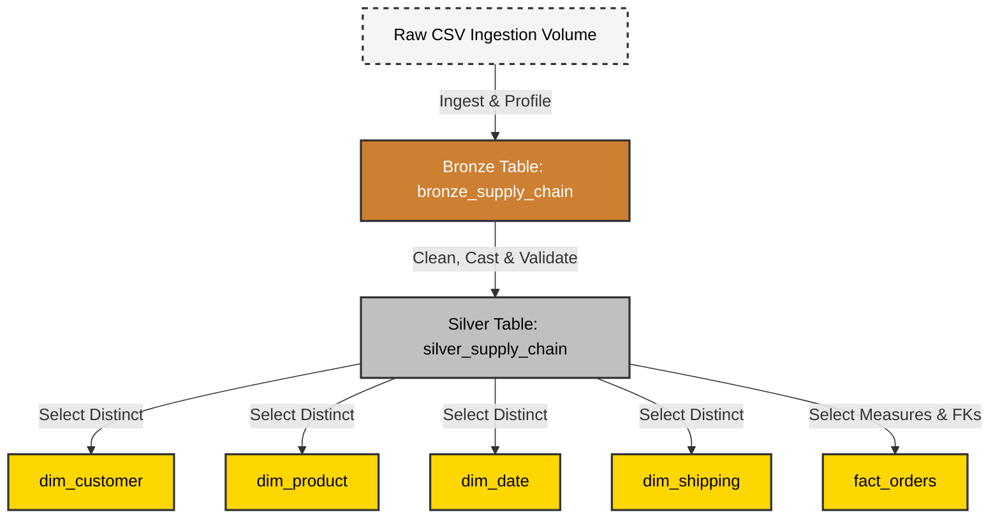
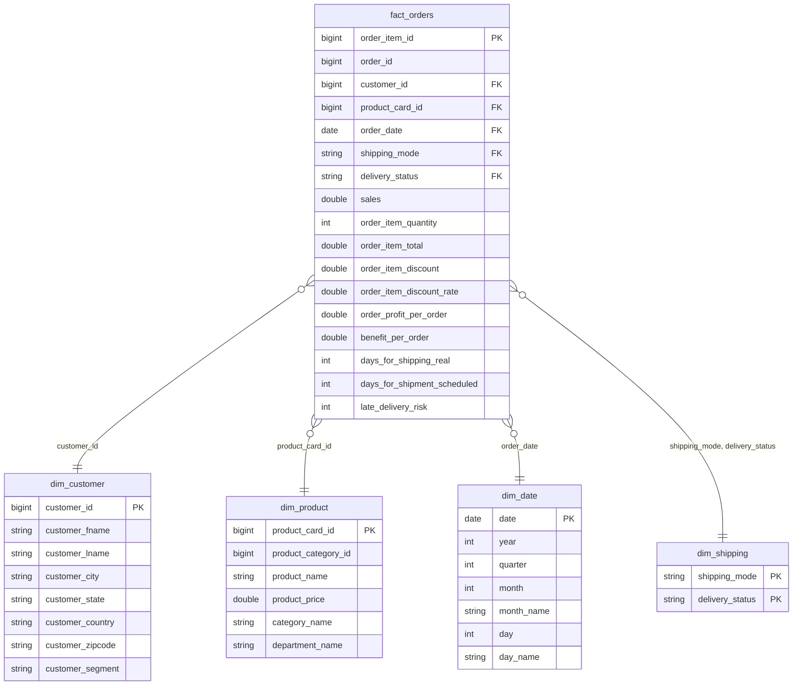

# 📊 Supply Chain Control Tower using Databricks

[](https://databricks.com/)
[](https://spark.apache.org/)
[](https://delta.io/)
[](https://www.python.org/)
[](https://en.wikipedia.org/wiki/SQL)
[](https://databricks.com/product/unity-catalog)

---

## 1. Project Overview

This project implements an end-to-end Data Engineering pipeline for a **Supply Chain Control Tower** built on the **Databricks Lakehouse Platform**. 

The pipeline ingests raw transactional supply chain data, processes it through a multi-stage **Medallion Architecture (Bronze, Silver, Gold)** using **PySpark** and **Delta Tables**, and models the data into a optimized **Star Schema** managed under **Unity Catalog**. The end goal is to clean and organize raw metrics into secure, query-ready tables designed for business intelligence, logistics tracking, and operational analysis.

---

## 2. Architecture

The pipeline processes data sequentially across three analytical zones. The following flow diagram traces the lifecycle of the supply chain dataset:



---

## 3. Technology Stack

| Technology | Purpose in Project |
| :--- | :--- |
| **Databricks** | Unified environment for notebooks, clusters, and runtimes |
| **PySpark** | Distributed processing engine for transformations at scale |
| **Python** | DataFrame API operations, cleaning syntax, and data validation rules |
| **SQL** | Dimensional table creation, database catalog structures, and auditing |
| **Delta Lake** | ACID transactions, time travel, schema enforcement, and fast performance |
| **Unity Catalog** | Centralized data governance, storage volumes, schemas, and tables |
| **Delta Tables** | Format for all processing layers (Bronze, Silver, Gold) |

---

## 4. Dataset Overview

The dataset consists of historical supply chain transactions containing metrics for order management, customer shipping, product catalogs, and performance risks.
- **Granularity**: Order item row level
- **Scope**: Covers customer segments, shipping timelines, margins, profit rates, and delivery flags.
- **Data Attributes**: Customer names, categories, addresses, product codes, unit prices, shipment dates, delivery categories, and financial indicators.

---

## 5. Medallion Architecture

We implement a three-tier **Medallion Architecture** to isolate logic stages and maintain data quality:

1. 🟫 **Bronze Layer**: Raw storage layer. Preserves the original state of the incoming dataset without destructive updates.
2. ⬜ **Silver Layer**: Cleaned, verified, and normalized storage layer. Casts data types, removes noise columns, and runs primary validation assertions.
3. 🟨 **Gold Layer**: Analytical modeling layer. Organizes clean metrics into an optimized Star Schema (dimensions and facts) for fast aggregations and dashboards.

---

## 6. Bronze Layer

* **Data Ingestion**: Reads the raw CSV file directly from a secure **Unity Catalog Volume**.
* **Schema Handling**: Dynamically infers the schema structure during loading.
* **Data Profiling**: Analyzes initial columns, value ranges, and missing fields.
* **Validation Rules**:
  - Performs record count validation (checks total records imported).
  - Validates duplicate record count.
* **Formatting**: Converts headers into Delta-compatible strings by replacing spaces and brackets with underscores (e.g., `Product Card Id` $\rightarrow$ `product_card_id`).
* **Output**: Writes the output to the Delta Table `bronze_supply_chain`.

---

## 7. Silver Layer

* **Data Ingest**: Reads from the `bronze_supply_chain` Delta Table.
* **Transformation Operations**:
  - **Date Normalization**: Converts dates (`order_date` and `shipping_date`) from raw strings into uniform PySpark `Timestamp` values.
  - **Column Pruning**: Drops unnecessary fields that do not serve business or operational KPIs.
* **Data Cleaning**: Drops corrupted or null entries in key keys.
* **Data Validation**:
  - Asserts that all order item records remain unique.
  - Verifies date limits and ranges are valid.
  - Ensures order quantities are greater than zero.
* **Output**: Writes clean data to the Delta Table `silver_supply_chain`.

---

## 8. Gold Layer

Data is modeled into a Star Schema. 

### Dimension Tables

#### 👥 dim_customer
* **Description**: Holds clean customer records.
* **Columns**: `customer_id` (PK), `customer_fname`, `customer_lname`, `customer_city`, `customer_state`, `customer_country`, `customer_zipcode`, `customer_segment`

#### 📦 dim_product
* **Description**: Holds the inventory product catalog.
* **Columns**: `product_card_id` (PK), `product_category_id`, `product_name`, `product_price`, `category_name`, `department_name`

#### 📅 dim_date
* **Description**: A generated calendar dimension to support time-series reporting.
* **Columns**: `date` (PK), `year`, `quarter`, `month`, `month_name`, `day`, `day_name`

#### 🚚 dim_shipping
* **Description**: Captures combinations of shipping modes and delivery status.
* **Columns**: `shipping_mode` (PK), `delivery_status` (PK)

### Fact Table

#### 🛒 fact_orders
* **Description**: Stores transactional order items and physical metrics.
* **Measures**:
  - `Sales` (sales revenue)
  - `Quantity` (order item quantity)
  - `Profit` (profit per order)
  - `Discount` (item discount value)
  - `Discount Rate` (item discount rate percentage)
  - `Benefit per Order` (order margin benefits)
  - `Shipping Days` (days for shipping real and scheduled)
  - `Late Delivery Risk` (flag identifying delayed delivery risk)

---

## 9. Star Schema

The Star Schema separates descriptive context from performance measurements. This modeling approach enables efficient joins and is highly optimized for Business Intelligence dashboards (e.g. Power BI or Tableau) and analytical aggregates (e.g. SQL group-by operations).

The relationships between the tables are structured as follows:



---

## 10. Data Validation

To guarantee structural consistency and compliance with schema layouts, automated data audits verify the tables at runtime:

| Validation Step | Rule Performed | Expected Metric | Status |
| :--- | :--- | :---: | :---: |
| **Row Count Validation** | Compare Bronze, Silver, and Fact records | `180,519` |  Passed |
| **Duplicate Validation** | Verify `order_item_id` uniqueness | `0` duplicates |  Passed |
| **Date Validation** | Audit parsed order date format limits | `0` null dates |  Passed |
| **Quantity Validation**| Ensure `order_item_quantity` is valid | `> 0` |  Passed |
| **Schema Validation** | Assert columns conform to expected definitions | Complete Match |  Passed |

---

## 11. Project Workflow

The following execution flow outlines the data journey:

1. **Volume Landing**: Raw CSV data is uploaded to a Unity Catalog Volume.
2. **Bronze Run**: CSV file is read, schema is inferred, spaces in headers are standardizerd, and the raw dataset is saved to a Bronze Delta table.
3. **Silver Cleanse**: The Bronze Delta table is read, string columns for dates are parsed into `Timestamp` datatypes, irrelevant metadata columns are dropped, row count validations are executed, and data is saved to a Silver Delta table.
4. **Gold Modeller**: Dimensions and Fact datasets are derived from the Silver Delta table and written to their respective Gold Delta tables, establishing the analytical Star Schema.

---

## 12. Project Statistics

* **Total Records Processed**: `180,519`
* **Unique Customers**: `20,652`
* **Unique Catalog Products**: `118`
* **Shipping Combinations**: `12`
* **Calendar Date Dimension Range**: `1,127 dates`

---

## 13. Folder Structure

```directory
supply-chain-control-tower-databricks/
├── notebooks/
│   ├── 01_bronze_ingestion.py         # Bronze layer loading & naming standardization
│   ├── 02_silver_transformation.py    # Silver layer cleansing, casting & data audits
│   └── 03_gold_modeling.py            # Gold layer dimensional and fact modeling
├── schemas/
│   ├── bronze_schema.py               # Predefined Spark schemas for ingestion
│   └── gold_schema.sql                # SQL definitions for Star Schema
├── LICENSE                            # MIT License details
└── README.md                          # Project Documentation
```

---

## 14. Future Improvements

* **Auto Loader Integration**: Convert notebooks to utilize Databricks Auto Loader (`readStream`) to detect and ingest new CSV files landing on UC Volumes incrementally.
* **Orchestration**: Schedule notebook pipelines using **Databricks Workflows** or Apache Airflow, enabling error alerting.
* **Data Quality Framework**: Introduce **Delta Live Tables (DLT)** expectations to clean and quarantine low-quality records.

---

## 15. Screenshots (placeholder)

*Insert your workspace snapshots here:*

#### Databricks Job Run Graph

*Placeholder: Databricks Job Run dashboard displaying successful Bronze, Silver, and Gold execution stages.*

#### Catalog Explorer View

*Placeholder: Databricks Catalog Explorer screen displaying the Gold tables under the Unity Catalog Schema.*

---

## 16. How to Run

1. **Unity Catalog Storage Setup**:
   Create a Catalog (e.g. `supply_chain_dev`), a Schema (e.g. `control_tower`), and an Ingestion Volume (e.g. `raw`) in your Databricks Workspace.
2. **Upload CSV**:
   Upload the raw CSV dataset into the Catalog Volume path `/Volumes/supply_chain_dev/control_tower/raw/`.
3. **Workspace Import**:
   Import this git repository directly into your Databricks Workspace Repos.
4. **Pipeline Execution**:
   - Run the notebook `notebooks/01_bronze_ingestion.py` to create the table `bronze_supply_chain`.
   - Run the notebook `notebooks/02_silver_transformation.py` to cleanse and compile the table `silver_supply_chain`.
   - Run the notebook `notebooks/03_gold_modeling.py` to generate the Gold Dimensions and Fact tables.

---

## 17. Key Learnings

* **Medallion Architecture benefits**: Gained experience in structural separation between raw landing files, cleaned datasets, and optimized tables.
* **Schema Enforcement**: Understood how Delta Lake guarantees strict validation checks on data write.
* **Delta Lake Operations**: Learned how optimization commands (like `OPTIMIZE` and Z-Ordering) impact query retrieval speeds.
* **Unity Catalog Governance**: Explored the security structure of catalogs, schemas, volumes, and table access control lists on Databricks.

---

## 18. Resume Project Description

* Copy-pasteable resume summary:
> **Supply Chain Control Tower | Databricks, PySpark, Delta Lake, Unity Catalog**
> * Designed and built an end-to-end Medallion Architecture pipeline to ingest and transform **180,000+** raw Supply Chain records.
> * Standardized schemas and implemented data type transformations using **PySpark** to ingest CSV documents into transactional **Delta Tables**.
> * Modeled an analytical **Star Schema** (4 dimensions, 1 fact table) hosting operational supply chain KPI indicators like delivery risk and margin profits.
> * Implemented validation constraints to verify record integrity, duplicates, dates, and order quantity limits.
> * Utilized **Unity Catalog** for centralized table schemas, external volumes, and data security governance.

---

## 19. Author

* **Name**: Nisha Sorallikar
* **GitHub**: [@nishasorallikar](https://github.com/nishasorallikar)
* **LinkedIn**: [Nisha Sorallikar](https://linkedin.com/in/your-profile-placeholder)
