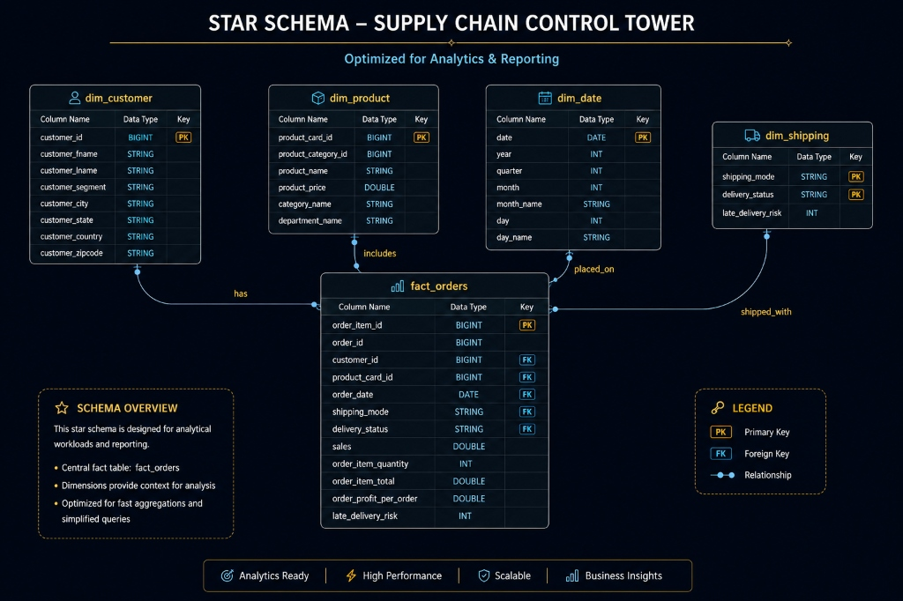

# 📐 Star Schema Modeling & Design

To enable high-performance BI queries, aggregations, and business intelligence reporting, the Gold Layer is modeled into a clean, optimized **Star Schema**. This architectural pattern decouples transactional facts from descriptive dimensions, ensuring fast joins and query-performance optimizations (such as partition pruning).

### 📐 Entity-Relationship Diagram (ERD)

### 📊 Schema Components & Table Specifications

The database model is structured around a central **Fact Table** surrounded by four descriptive **Dimension Tables**:

#### 🛒 1. Central Fact Table: `fact_orders`
* **Grain**: One record per order item.
* **Keys (Foreign Keys)**: 
  * `customer_key` (FK to `dim_customer`)
  * `product_key` (FK to `dim_product`)
  * `date_key` (FK to `dim_date`)
  * `shipping_key` (FK to `dim_shipping`)
* **Identifiers**: `order_id` (Unique Order String)
* **Measures (Metrics)**:
  * `order_quantity` (Quantity ordered)
  * `order_amount` / `total_amount` (Transactional sale and revenue metrics)
  * `discount_amount` (Applied discount deductions)
  * `shipping_cost` (Logistics delivery cost)
  * `tax_amount` (Calculated government taxes)
  * `profit_amount` (Calculated margin benefits)

#### 👥 2. Customer Dimension: `dim_customer`
* **Key**: `customer_key` (Surrogate Key - PK)
* **Attributes**: `customer_id` (Source ID), `customer_name`, `customer_segment` (Consumer, Corporate, etc.), and complete address details (`country`, `state`, `city`, `postal_code`, `created_date`).

#### 📦 3. Product Dimension: `dim_product`
* **Key**: `product_key` (Surrogate Key - PK)
* **Attributes**: `product_id` (Source ID), `product_name`, `product_category`, `product_subcategory` (Categories and departments), `brand`, and pricing details (`unit_price`, `created_date`).

#### 🚚 4. Shipping Dimension: `dim_shipping`
* **Key**: `shipping_key` (Surrogate Key - PK)
* **Attributes**: `shipping_mode` (First Class, Second Class, etc.), `carrier`, `service_level`, and transit duration (`delivery_time_days`, `created_date`).

#### 📅 5. Date Dimension: `dim_date`
* **Key**: `date_key` (Surrogate Key - PK)
* **Attributes**: Complete calendar tracking (`full_date`, `day`, `day_name`, `week`, `month`, `month_name`, `quarter`, `year`) and operational flags (`is_weekend`, `is_holiday`).
